<h2 align="center">Parallel Deep Reinforcement Learning for Terrestrial Mobile Robots</h2>

<p align="center">
  
  
  
  
  
  
  
  
</p>
<br/>

## Objective
<p align="justify"> 
  <a>In this repository, we present a study of deep reinforcement learning techniques that uses parallel distributional actor-critic networks to navigate terrestrial mobile robots. Our approaches were developed taking into account only a couple of laser range findings, the relative position and angle of the mobile robot to the target as inputs to make a robot reach the desired goal in an environment.
We used a real-to-sim development structure, where the agents trained in the Gazebo simulator were deployed in real scenarios to enhance the evaluation further.
Based on the results gathered, it is possible to conclude that parallel distributional deep reinforcement learning’s algorithms, with continuous actions, are effective for decision-make of a terrestrial robotic vehicle and outperform non-parallel-distributional approaches in training time consumption and navigation capability.</a>  
</p>
  

## Setup
<p align="justify"> 
 <a>All of requirements is show in the badgets above, but if you want to install all of them, enter the repository and execute the following line of code:</a>
</p>

```shell
pip3 install -r requirements.txt
```

<p align="justify"> 
 <a>Before we can train our agent, we need to configure the config.yaml file. Some parameters seems a bit unbiguous, make sure the correct token key of comet is setted instead disable it. Another thing to do is choose an algorithm to perform your training, choose between PDDRL and PDSRL. </a>
</p>

<p align="justify"> 
 <a>With the config.yaml configured, now we can train our agent, to do this just run the following code:</a>
</p>

```shell
python3 train.py
```

We strongly recommend using the package with the pre-configured <a href="https://github.com/victorkich/Parallel-Turtle-DRL/pkgs/container/ros">docker image</a>. Don't forget to use the <a href="https://docs.nvidia.com/datacenter/cloud-native/container-toolkit/install-guide.html#docker">nvidia container toolkit</a>  to enable GPU usage within docker. 
Inside the docker image, just use the following command to download and install the data from the training and evaluation repositories: 

```shell
zsh setup.sh
```

Note: depending on the speed of your internet connection this can take a long time. 

## Structure
<p align="justify"> 
  The networks of our proposed PDDRL and PDSRL approaches have three hidden fully-connected layers with 256 neurons each and connected through ReLU activation for the actor-network. The action ranges between -1 and 1, and the hyperbolic tangent function <em>Tanh</em> was used as the activation function. The outputs are scaled between -0.12 and 0.15 meters for the linear velocity, and from -0.1 m/s to 0.1 m/s for the angular velocity. The PDDRL and PDSRL network structure model used can be seen in figure bellow. For both approaches, the Q-value of the current state is predicted in the critic network, while the actor-network predicts the current state. 
</p>

<p align="center"> 
  
  
</p>

## Results

<p align="center"> 
  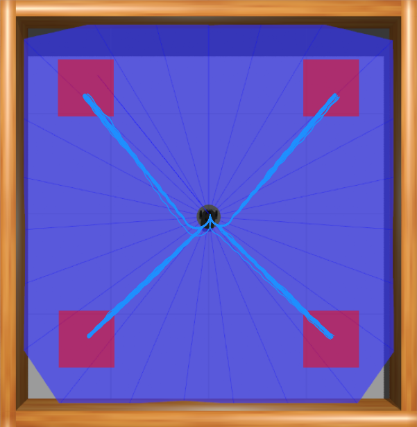
  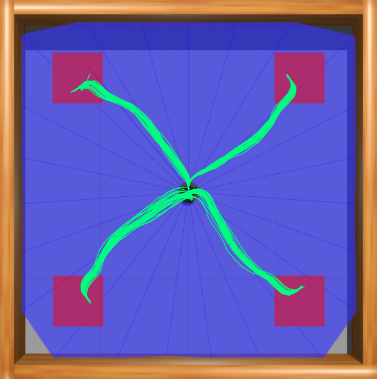
  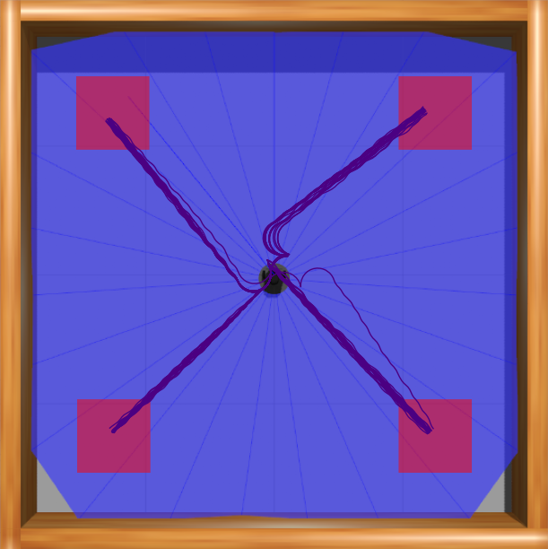
  
  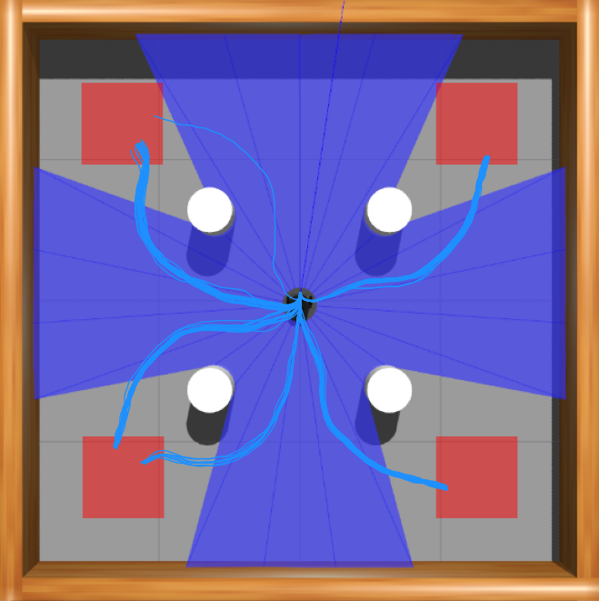
  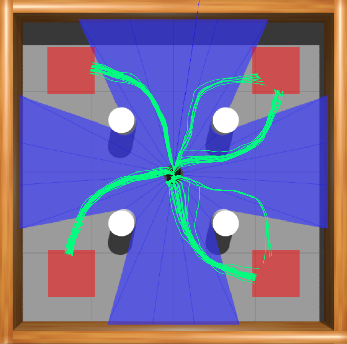
  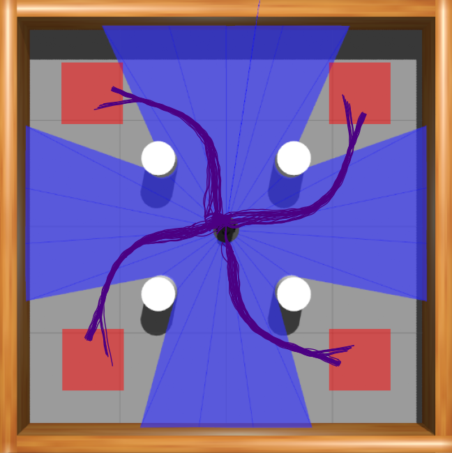
  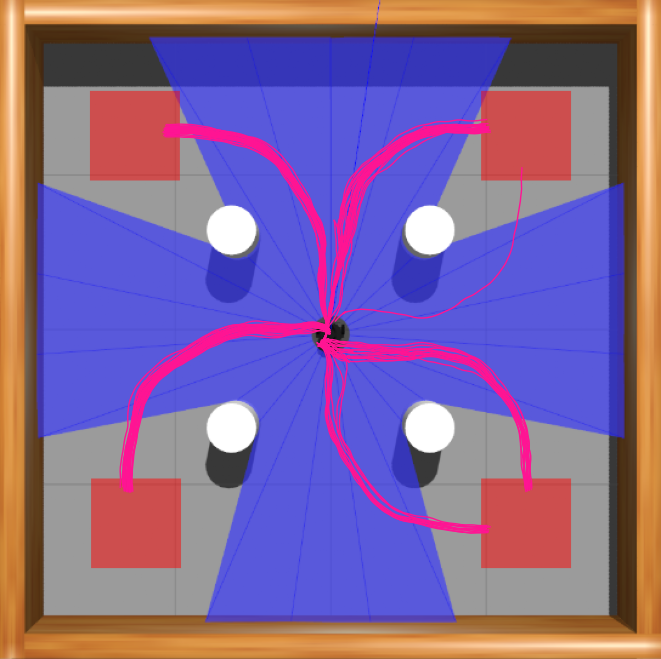
  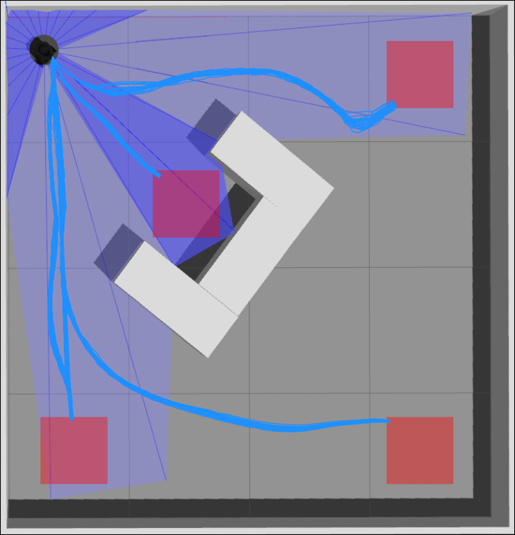
  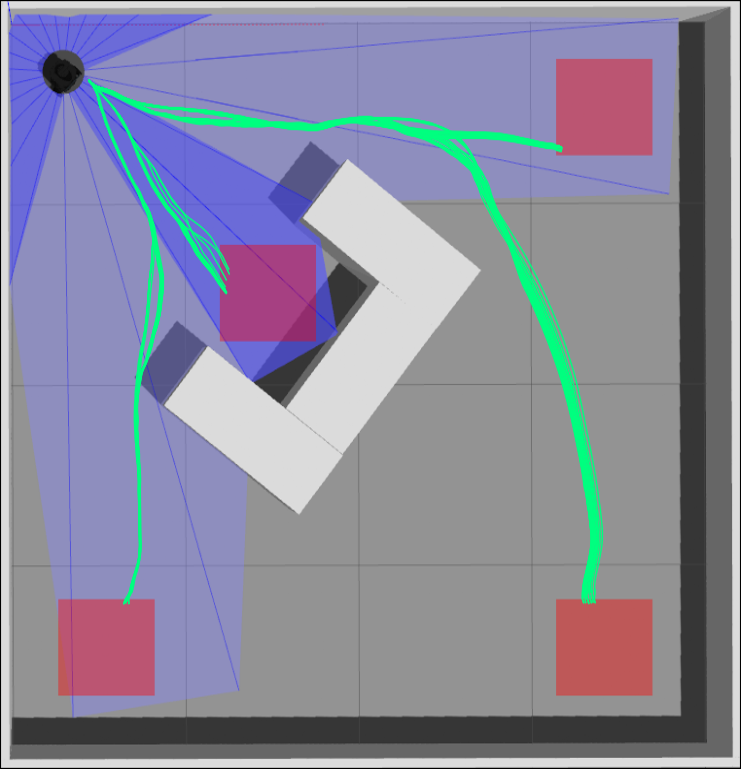
  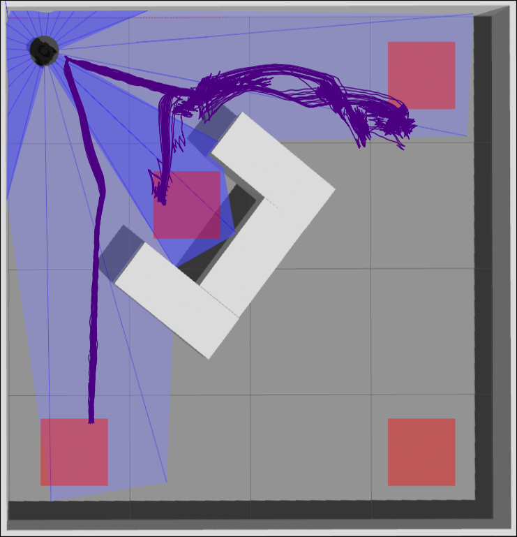
  
  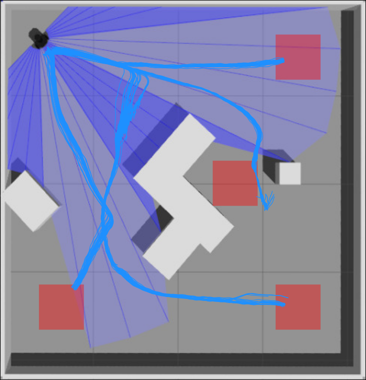
  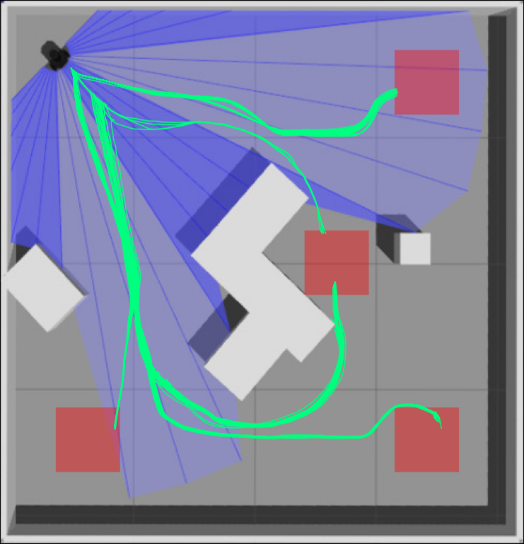
  
  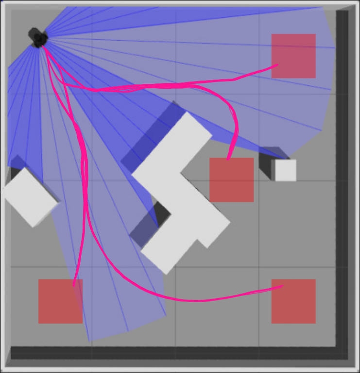
</p>

See more about the results in the [YouTube video](https://youtu.be/mbOiTUvjrCU).

<p align="center"> 
  <i>If you liked this repository, please don't forget to starred it!</i>
  
</p>

